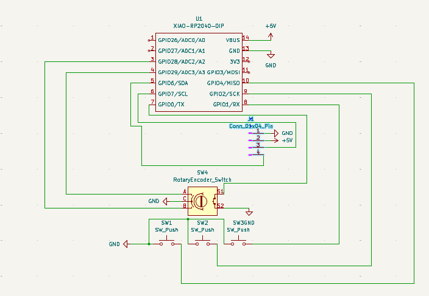
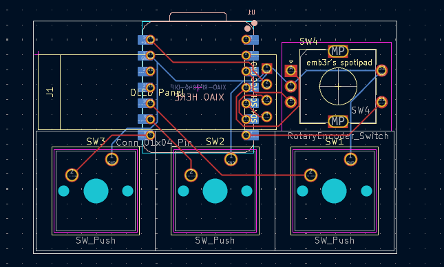
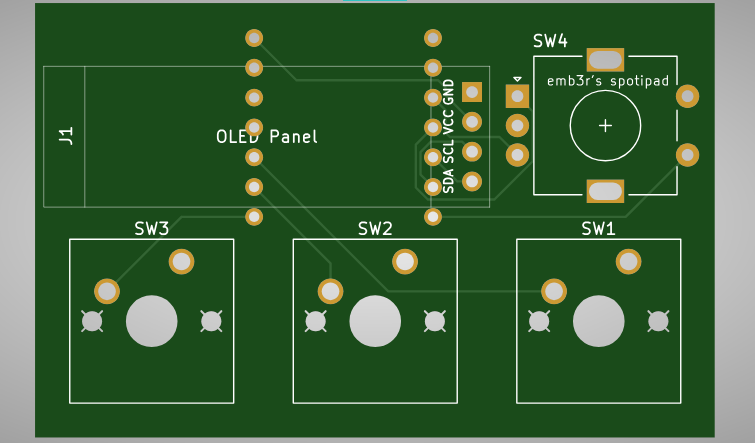
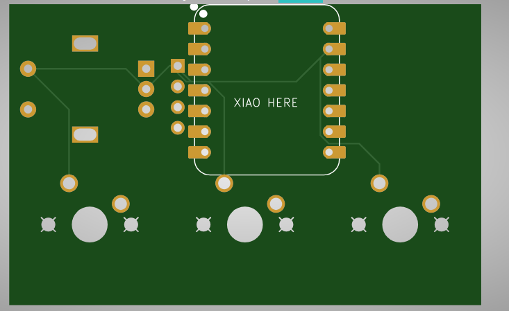
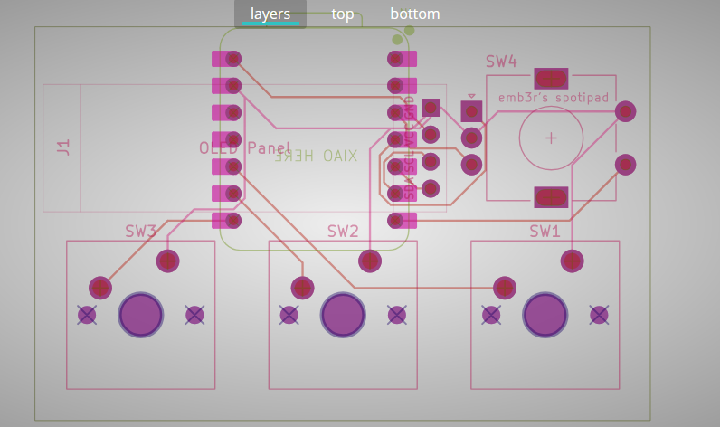
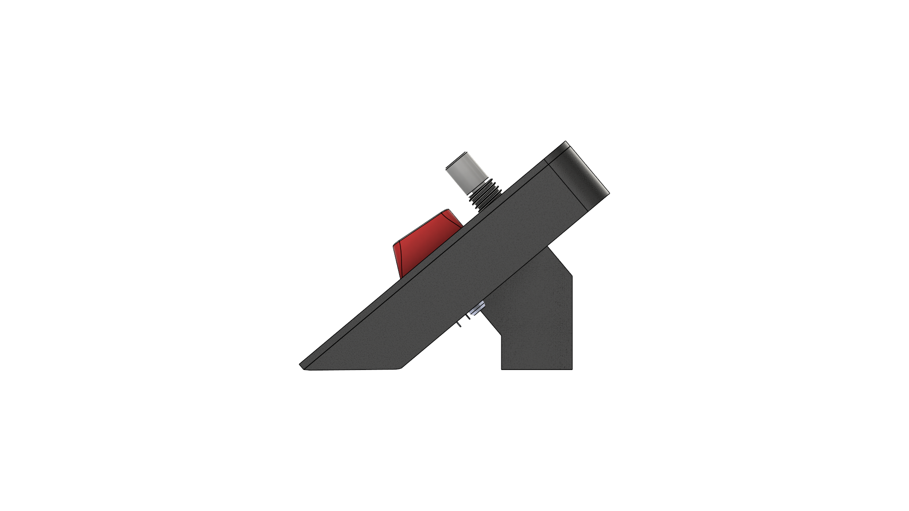
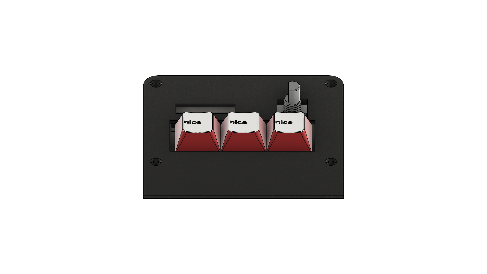
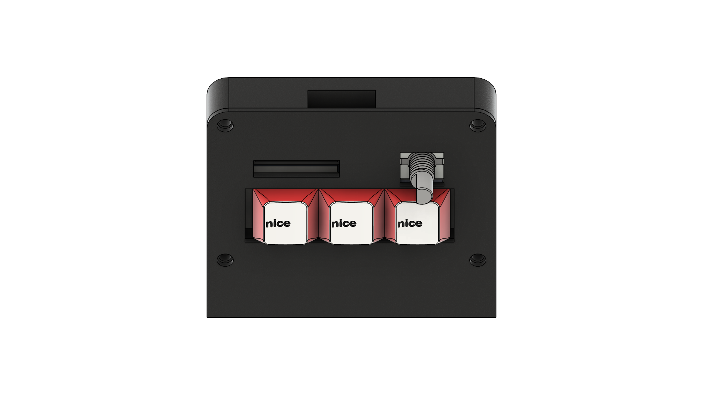
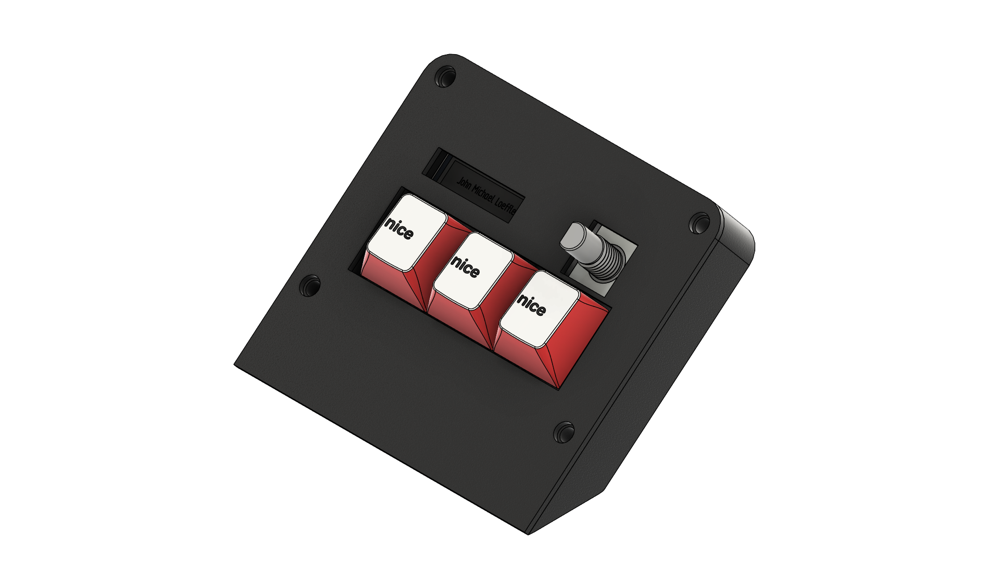

# spotipad
Spotify control micropad made for hackpad.hackclub.com
# Background
I have wanted to make something like this for months now. My idea arose when I saw the death of Spotify's "CarThing" which people used as a desk accessory. I didn't have CarThing, so I couldn't use it in this way, so I tried making an improvised one using an old Android phone I had lying around and some live wallpaper app. It didn't work well. Now, when I saw an email in my inbox about hackclub, and saw that I could make a micropad for basically free, I was euphoric. I like to do stuff. I have many ideas for some hardware stuff but don't have funds to bring them to life. Sadly, I discovered hackclub at the end of this "highway." If there will be another "edition," I will do all hands on deck to fully participate. This creation (at least the first iteration) was made in 1 night after 1 too many caffeine capsule (don't do this; it is bad for you 😇). It was also the first time I did PCB and the first time I 3D-designed something that will really be sent to be printed.
# PCB
Please, don't judge me too much, it is my first PCB xD.
## KiCad
- Schematic:

- PCB:

## External Gerber Viewer
- Front

- Back

- Layers

# Case
The case is tilted 40 degrees so you can see the display!.

# Code
Right now, the code is sloppy and probably won't work. The reason is that I don't have the microcontroller yet, so I don't know how to check if the code works, and there's nothing I hate more than writing code blindly without the ability to test it. The current code is more a visualization of my idea:
Spotipad connects normally via USB
Keys and turn-knob send media keys (volume up/down, mute, next/previous track, pause/play).
The screen has 3 options (currently only 1 is “visualized” via demo code).
1. Connect to a locally hosted Flask server that checks the currently played track name and author and sends it via USB Serial Data.
2. Displays text set in config file/GUI (TO:DO)
3. Displays 128x32 image set in config file/GUI (TO:DO)
# Credits
- 3D Models:
1. MX Switch model - [Gal Pavlin](https://grabcad.com/gal.pavlin-2) - [link](https://grabcad.com/library/cherry-mx-switch-2)
2. MX Keycap Model - [Josh Hinnebusch](https://github.com/hineybush/CherryMX/tree/master) - [link](https://github.com/hineybush/CherryMX/tree/master)
3. EC11 Rotary Encoder - [甘草酸不酸](https://grabcad.com/671f3b2e37-1) - [link](https://grabcad.com/library/rotary-encoder-17)
4. SSD1036 0.91" OLED 128x32px display - [John](https://grabcad.com/john-772) - [link](https://grabcad.com/library/0-91in-oled-1)
# BOM
- 1x Seeed XIAO RP2040
- 3x MX-Style switches
- 1x EC11 Rotary encoder
- 1x SSD1036 0.91 inch OLED display
- 3x Blank DSA keycaps
- 4x M3x16mm screws
- 1x 3D printed case (base + top plate)
